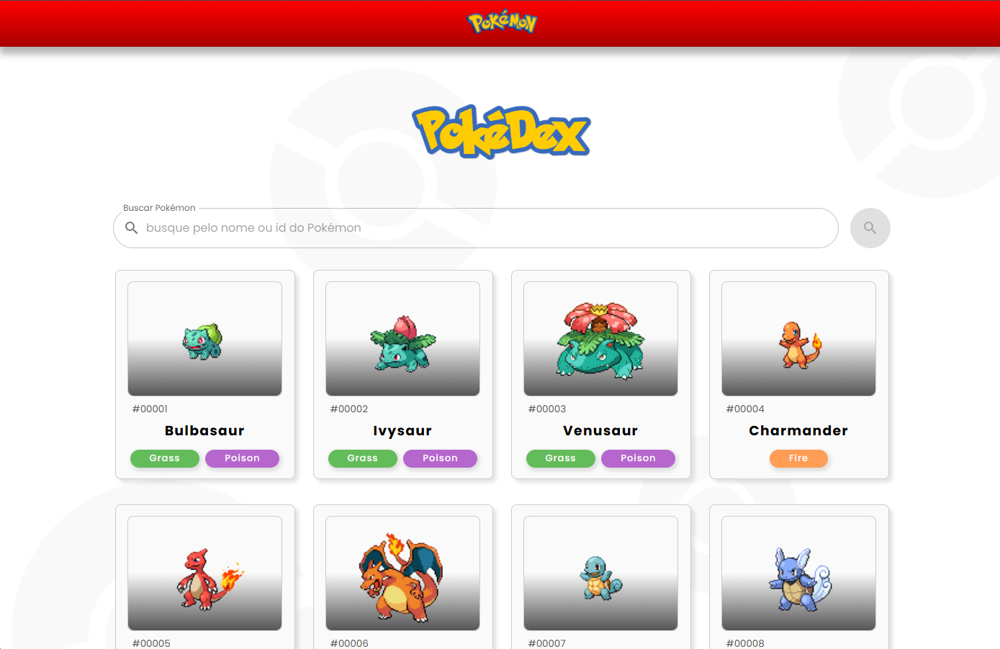
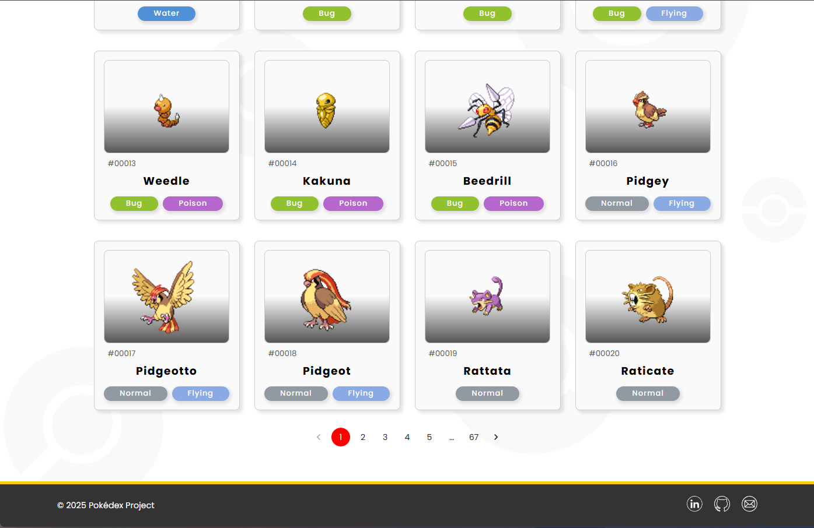
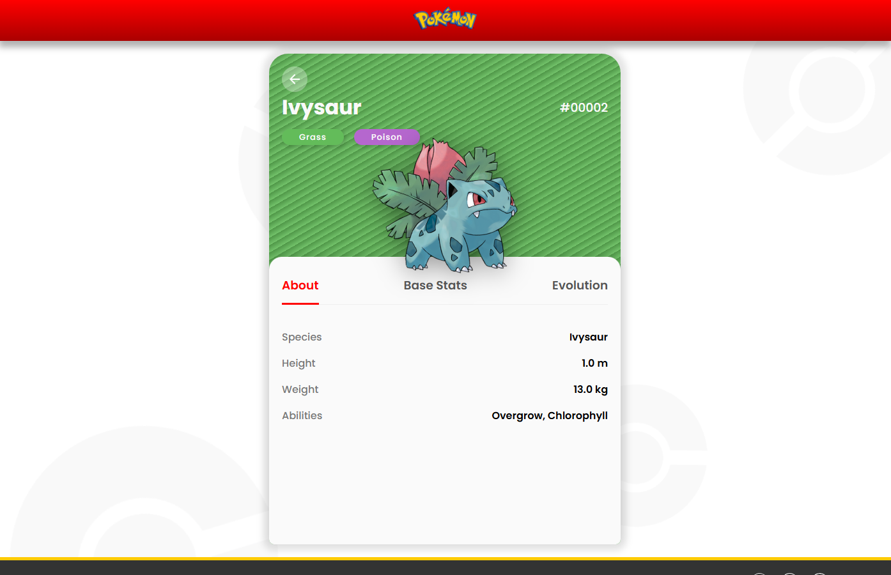

# ⚡ Pokédex ReactJS
Esta é uma aplicação frontend construída com React e Redux, desenvolvida para listar, paginar e buscar detalhes de Pokémons através da API pokeApi.

## Pré-requisitos
Para rodar esta aplicação, você precisará ter instalado em sua máquina:
- Node.js (versão LTS recomendada)
- npm (gerenciador de pacotes do Node.js) ou Yarn

## Instalação e Configuração
Siga os passos abaixo para preparar o ambiente local.

1. Clonar o Repositório

```
> git clone https://github.com/luthianopacheco/pokedex-react.git
> cd path/to/pokemon-dex-app
```


2. Instalar as Dependências

Dentro do diretório do projeto, execute o comando para instalar todas as dependências necessárias:

```
npm install
```

## Execução da Aplicação

Após instalar as dependências, você pode rodar a aplicação localmente.
Execute o comando a seguir. A aplicação será aberta automaticamente no seu navegador, geralmente em http://localhost:3000.
```
npm start
```

## Screenshots






## Execução dos Testes
O projeto utiliza Jest e React Testing Library (RTL) para testes.
Para executar o conjunto de testes e entrar no modo de watch interativo (que roda novamente os testes ao salvar arquivos):
```
npm test
```